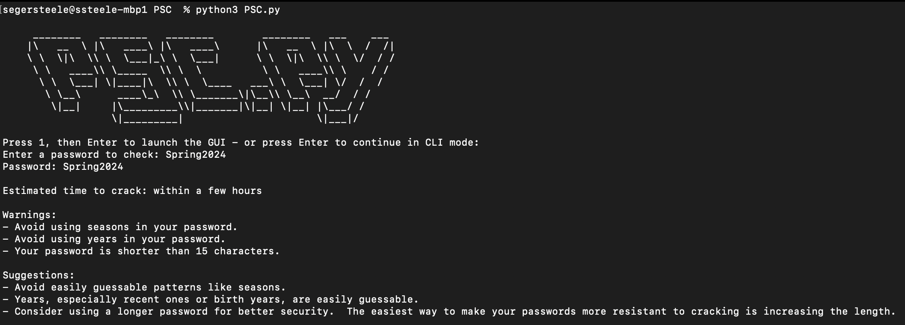
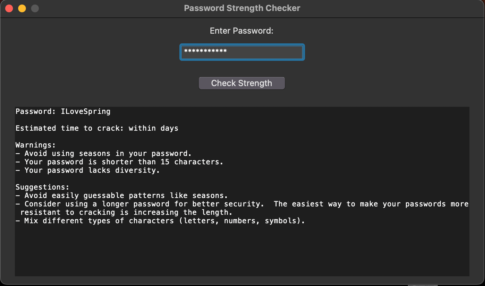
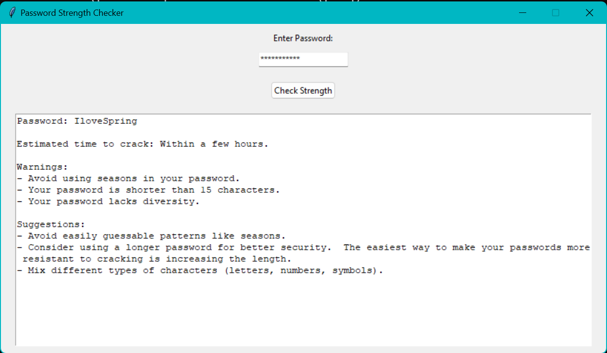

# Password Strength Checker

Python-based Password Strength Checker (PSC) offering CLI and GUI to analyze password strength with an estimated brute-force cracking time. Includes actionable feedback with custom password and pattern checks.

## Features:

- Evaluates password strength from provided passwords.
- Estimates the time it would take to crack the password.
- Provides custom warnings and suggestions for improving password strength.
- CLI & GUI Options.
- Checks for:
    - Password Length
    - Common password usage
    - Usage of seasons
    - Usage of years
    - Character type diversity

## Installation:

- Install the required library: [requirements.txt](https://github.com/Seger-Steele/Password-Strength-Checker/blob/main/requirements.txt)
- Ensure you downloaded [10k-most-common.txt](https://github.com/Seger-Steele/Password-Strength-Checker/blob/main/10k-most-common.txt).  What I provide is a copy from [Daniel Miessler Seclists](https://github.com/danielmiessler/SecLists/blob/master/Passwords/Common-Credentials/10k-most-common.txt)

## Usage:

### CLI:

- Run PSC.py from your terminal (zsh example): python3 PSC.py
- When asked whether you want GUI or CLI, press "Enter".
- Enter a password and press "Enter" to check its strength. 

Example(zsh): 

### GUI:

- Run PSC.py from your terminal and press "1", then "Enter" at the prompt to launch the GUI.
- Enter a password in the entry field and click "Check Strength."
- The results will be displayed in the text box below.

Example(macOS): 

Example(Windows): 

## License
This project is licensed under the MIT License. See the [LICENSE](https://github.com/Seger-Steele/Password-Strength-Checker/blob/main/LICENSE) file for details.

## Additional Notes:
This script uses the zxcvbn library to estimate password strength and assign it a score. For more information on the zxcvbn library, see its documentation: https://zxcvbn-ts.github.io/zxcvbn/guide/getting-started/.

The script also loads a list of common passwords from a from [Daniel Miessler Seclists](https://github.com/danielmiessler/SecLists/blob/master/Passwords/Common-Credentials/10k-most-common.txt).  The list of common passwords can be updated as wanted by modifying "load_common_passwords()". 
